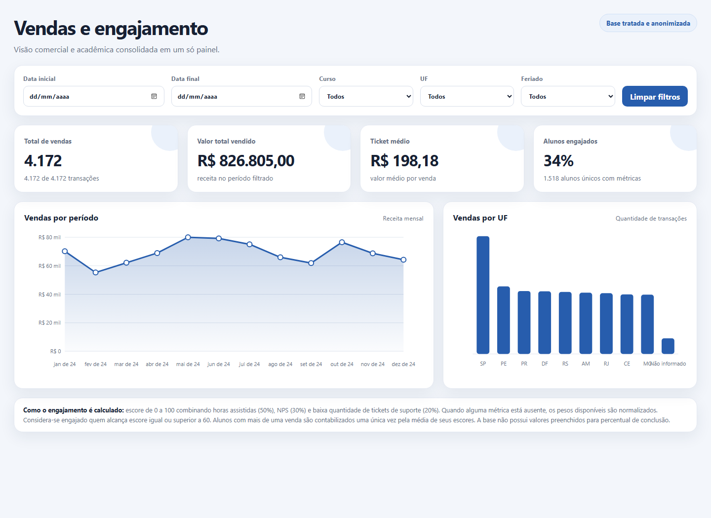
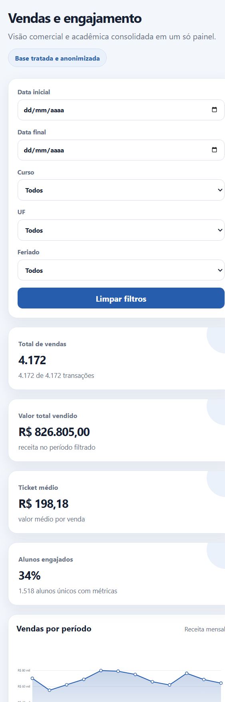

<p align="center">
  <a href="README.md"></a>
  <a href="README.pt-BR.md"></a>
</p>

# Dashboard de Vendas e Engajamento

Um dashboard local e leve que reúne indicadores de desempenho comercial e
engajamento dos alunos em uma única visualização.

A aplicação lê exclusivamente o arquivo `relatorio_final.csv`, uma base
tratada, enriquecida e anonimizada. Nenhum arquivo bruto é acessado pelo
dashboard.

## Capturas de Tela

### Visão geral em desktop



### Visualização responsiva em dispositivos móveis

<p align="center">
  
</p>

## Funcionalidades

- Indicadores de total de vendas, receita total e ticket médio
- Evolução mensal da receita
- Distribuição das vendas por estado brasileiro
- Taxa de engajamento dos alunos e cobertura das métricas
- Filtros por período, curso, estado e vendas realizadas em feriados
- Layout responsivo para telas desktop e mobile
- Envio ao navegador somente dos campos necessários para o dashboard

## Executando Localmente

### Requisitos

- Python 3

### Inicie o dashboard

```powershell
python dashboard.py
```

Abra [http://127.0.0.1:8000](http://127.0.0.1:8000) no navegador.

O endpoint de verificação está disponível em
[http://127.0.0.1:8000/health](http://127.0.0.1:8000/health).

## Pontuação de Engajamento

A pontuação de engajamento varia de 0 a 100 e combina:

- horas assistidas: 50%
- pontuação NPS: 30%
- baixa quantidade de tickets de suporte: 20%

Quando alguma métrica não está disponível, os pesos restantes são
normalizados. Um aluno é considerado engajado quando sua pontuação é igual ou
superior a 60. Alunos com várias compras são contabilizados uma única vez,
utilizando a média de suas pontuações.

## Privacidade

CPF, CEP e identificadores de transações não são enviados ao navegador. As
compras pertencentes ao mesmo aluno são associadas somente por meio de um hash
gerado no servidor.
